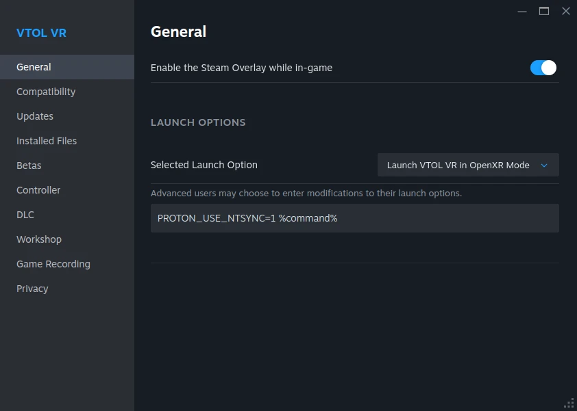
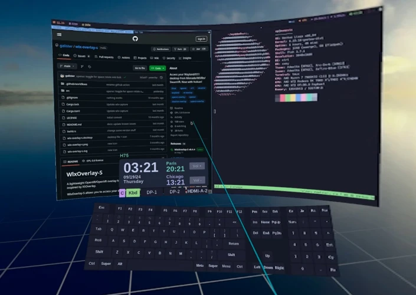

# WiVRn: A Comprehensive Wireless VR Guide

**_Please carefully read everything, especially the [requirements](#requirements) and [compromises](#compromises) sections, it will save you a lot of headaches and frustration._**

**_Please also note this guide is based upon my own experiences, testing, and opinions and is by no means a comprehensive guide to everything VR or Linux!!!_**

---
## Summary

The best way I have found to play with standalone VR headsets in Linux is by using [WiVRn](https://github.com/WiVRn/WiVRn). WiVRn is a solution similar to [ALVR](https://github.com/alvr-org/ALVR), [Air Link](https://www.meta.com/help/quest/509273027107091/), and [Virtual Desktop Standalone](https://www.meta.com/experiences/virtual-desktop/2017050365004772/), all providing a wireless solution to VR gaming. ALVR supports both Microsoft Windows and Linux, while both Air Link and Virtual Desktop Standalone both only support Microsoft Windows.

WiVRn supports both wired (via USB) and fully wireless play, but this guide only covers wireless VR, as I personally have not tried a Link Cable before.

I fully consider standalone wireless VR as fully stable for regular everyday use, assuming all of the following requirements are met.

## Requirements

- **Basic knowledge of Linux and terminal/command line.**
	+ Not everything can be done with a GUI, and some terminal usage will be needed
	+ Basic knowledge of terminal and how to solve issues yourself will go a long way, especially if something goes wrong.
	+ Ability to search for help and answers on your own via Google/Reddit.
	+ Understanding the importance of finding and following relevant documentation.

- **A  headset that is supported by WiVRn.**
	+ WiVRn supports the following headsets for wireless play:
		+ Quest 2, Quest 3, Quest 3S, Quest Pro, Pico Neo 4, HTC Vive Focus 3, and HTC Vive XR Elite

- **A decent WiFi 5 or newer (AC, AX) network.**
	+ WiVRn requires a decent wireless and wired network with little to no interference. I have tested WiVRn on both AC and AX networks.
		+ _There is a wired USB mode for WiVRn, but I have not tested it myself, so it is not covered by this guide._

- **Wired Gigabit connection between computer and router.**
	+ Latency and quality will both have issues if you try using any form of wireless/hotspot to connect your computer to your router. Other solutions like Air Link, ALVR, and Virtual Desktop also **REQUIRE** a wired GIGABIT connection from the computer to the router, and so does this guide. ***YOU MUST HAVE WIRED ETHERNET FROM YOUR COMPUTER TO YOUR ROUTER!!!*** Use of wireless hotspots is NOT SUPPORTED under any circumstances.
	
- **Linux kernel version 6.15 or newer.**
	+ [ntsync](https://docs.kernel.org/userspace-api/ntsync.html) requires newer kernels. Without it you may run into performance degradations, graphical glitches, or crashes, and some games will not work correctly at all (such as [VTOL VR](https://store.steampowered.com/app/667970/VTOL_VR/))

- **A proton branch that supports [ntsync](https://docs.kernel.org/userspace-api/ntsync.html), such as [Proton-GE](https://github.com/GloriousEggroll/proton-ge-custom) or [cachyos-proton](https://wiki.cachyos.org/configuration/gaming/#essential-packages).**

- **Stable hardware, software, and network.** Many VR issues can be tracked down to being unrelated to the VR hardware or software. Ensure your system is up to snuff before attempting to run VR in Linux.

- A fully functioning [Steam](https://store.steampowered.com/about/) installation.

## Compromises

WiVRn has several limitations compared to other streaming solutions, especially those that utilize Microsoft Windows. Before deciding if this guide is for you, be aware of the following limitations:

- **No spacewarp/motion smoothing.**
	+ Currently no form exists for Linux that I personally know of. If you run older/weaker hardware and are already heavily dependent on frame gen to provide stable frame rates in VR, be aware that your FPS will be cut in HALF by moving to Linux due to lack of any motion smoothing. You can compensate by lowering your streaming resolution, but it will result in a loss of quality otherwise.

- **Time investment:**
	+ Expect some extra troubleshooting and setup, as per this guide. Knowledge is key, and although the switch from Windows to Linux seems daunting, it just takes learning and practice like with anything. This guide should help you on your journey, and make things far more painless for you.

---
## Tested Linux Distributions

*NOTE: this section is based on my own recommendations, experiences, and testing. There are as many Linux distributions as stars in the night sky, so this is not a comprehensive list.*

I have personally tested VR in [Bazzite](https://bazzite.gg/), [CachyOS](https://wiki.cachyos.org/cachyos_basic/why_cachyos/) and [PikaOS](https://wiki.pika-os.com/en/home).

### Bazzite

[Bazzite](https://bazzite.gg/) is an semi-immutable distro by [universal blue](https://universal-blue.org/) based on [Fedora Atomic](https://fedoraproject.org/atomic-desktops/). A highly simplified distro, it is mainly designed for ease of use and is very beginner friendly. Mainly uses [Flatpak](https://flatpak.org/) for applications which can easily be installed via the [Bazaar](https://github.com/kolunmi/bazaar) app store. The system is much more locked down that traditional distros, and it is mainly geared towards HTPC setups with controllers. Also has builds for handhelds like the SteamDeck.

### CachyOS

[CachyOS](https://wiki.cachyos.org/cachyos_basic/why_cachyos/) is a traditional rolling release distribution based on [Arch Linux](https://archlinux.org/). CachyOS has gained a lot of momentum the past year, and recently reached #1 most popular distro on Distrowatch. Features the complexity and flexibility that Arch offers, but simplifies a lot of the setup and comes with tons of tweaks specific to newer hardware, as well as a great GUI installer. Features x86_64-v3 optimised packages for newer CPUs as optional choice during installation.

### PikaOS

[PikaOS](https://wiki.pika-os.com/en/home) is a fairly new rolling release distro based on [Debian](https://www.debian.org/intro/why_debian). Unlike Bazzite, PikaOS is a traditional distro that doesn't lock down the system. Features tons of gaming related tweaks like CachyOS, but requires more modern CPUs that support x86_64-v3. A stable base with updated applications thanks to custom packages and Flatpaks, PikaOS uses [Discover](https://apps.kde.org/discover/) as it's app store. Similar to Bazaar that Bazzite uses, Discover is much more mature and features full category sorting.

---
## Choosing a Distribution

My recommendation for a distro is very simplified, but should get you setup on the right track.

### CachyOS

CachyOS is hailed for it's flexibility, speed, and availability of most software due to the [Arch User Repository](https://aur.archlinux.org/). CachyOS is also a traditional distro that uses native packages. I wouldn't recommend CachyOS to novice computer users. Expect things to work out of the box, but if you want to tweak it you need to learn to ready CachyOS and ArchWiki documentation in detail or you will run into issues.

The AUR also can be very dangerous if you do not fully check and understand PKGBUILDs -- recently malware was discovered on the AUR that many users installed.

### Bazzite

Bazzite is best served as a HTPC hooked up to a large TV. Bazzite can auto-start inside of Steam Home, giving the Steam PC experience on large screens. It's desktop experience is very good though, and fully useable on desktops as an everyday operating systems.

### PikaOS

PikaOS is still a very new distro without a proven track record, but is still ready for daily use. Very beginner friendly like Bazzite, but features similar performance and tweaks like CachyOS, this is a very good distro. This is a good choice if you are familiar with Debian and prefer having a very stable base. Note that because it is based on Debian, certain packages related to your desktop environment will be slighty more out of date compared to the other distros.

---
## WiVRn

[WiVRn](https://github.com/WiVRn/WiVRn) wirelessly connects a standalone VR headset to a Linux computer. You can then play PCVR games on the headset while processing is done on the computer.

### WiVRn Installation

The installation method for WiVRn will vary depending on your distro of choice.

#### Bazzite/PikaOS

Search for "WiVRn" in your package manager of choice (Bazaar on Bazzite and Discover and PikaOS) and install the Flatpak for it.

#### CachyOS

If you are on CachyOS, you can use the following command to use paru to install it from [Arch User Repository](https://aur.archlinux.org/packages/wivrn-dashboard):

>`paru -S wivrn-dashboard`

## WiVRn Setup

Go ahead and launch WiVRn via your application launcher if you have not already.

You will first be greeted by the setup wizard. For this guide, you can skip the wizard completely by clicking through it and accepting all defaults until you get to the main page:

Note the two sliders:
+ Running:
	+ If this is toggled off, WiVRn will not run or accept connections from any headsets. You should always leave this toggled on.
		+ _Note: The WiVRn dashboard **MUST** be open on your desktop or the server will not be running or accept new connections. Completely closing the WiVRn dashboard completely shuts it down entirely._
		
+ Pairing:
	+ Enabled by default, the pairing slider allows headsets to be paired to your computer.

First, let’s set up WiVRn optimally for streaming quality and performance. Go ahead and click the “Settings” button in the top right of the WiVRn dashboard.

Edit the following settings:

+ Manual foveation:
	+ Set this to a minimum of 20%. Setting it lower than 20% may result in encoder overload in Linux. You can increase the slider to higher values to decrease encoder load, but the higher you go the more the outside of the image in your headset will be rendered at a lower resolution, reducing image quality the higher you go. 20% appears to be the sweet spot for Quest headsets.

+ Bitrate:
	+ This setting will depend on your encoder, available GPU power, and your wireless network. A good starting point is the default 50 MBit/s, which any decent router and network setup can easily handle. I personally use 120 MBit/s, as that is a decent balance of latency and quality.
		* _NOTE: Values higher than 120 MBit/s may result in encoder or network overload depending on your hardware setup._
		* _NOTE: Close the app on your headset, fully shut down your VR game, and fully restart the dashboard to ensure the settings take full effect after making any changes._

+ Encoder Layout:
	+ To set up the encoder layout, use the drop down box and select the “Low latency preset”. This will split the encoder into three threads, and you can then click in each box and force each of them to vaapi with H.265. Make sure not to click the center of the boxes or it will create another encoder split and you will have to start over.

Refer to the following tables to determine what encoder and codec to use. Take note that your hardware must also support the relevant codecs to be able to use them.

NOTE: The AV1 encoder requires more modern GPUs. On AMD, it is supported on 7000 series or newer, and on Nvidia 4000 series or newer is required.

- Quest 2 | Quest Pro | Pico Neo 4 | HTC Vive Focus 3 | HTC Vive XR Elite:

| GPU    | Encoder | Codec |
| ------ | ------- | ----- |
| AMD    | vaapi   | H265  |
| NVIDIA | nvenc   | H265  |

- Quest 3, Quest 3S

| GPU    | Encoder | Codec |
| ------ | ------- | ----- |
| AMD    | vaapi   | AV1  |
| NVIDIA | nvenc   | AV1  |

If your GPU hardware doesn't support AV1, use H265 as fallback instead.

You can try switching your codec to h.264 to get a reduction in latency, but note that you may see more banding in gradients if you do so. (This is true even on 8 bit displays!)

## WiVRn App

For Meta Quest headsets, simply install the WiVRn app from the Meta Quest store on your headset.

For others, you must download the APK and sideload it manually. The latest APK can be found on the [GitHub](https://github.com/WiVRn/WiVRn/releases) releases page for WiVRn.

### WiVRn App Setup

Once the app is installed, open it on your headset. You will be greeted by a simple UI. By default, camera passthrough will be enabled on headsets that support it.

Go ahead and click on your computer using the green “Connect” button. Make sure that the dashboard is open and running on your computer, and that your headset is connected to the same network.

You need to enter your pin PIN listed on the WiVRn dashboard the first time you connect to verify the connection.

Sometimes the code will time out as pairing mode disables after a few minutes for security. Move the pairing slider in WiVRn over to the right by clicking on it to re-enable pairing, or fully restart WiVRn on your computer and try again.

Please also note that your firewall may block connections to your PC. Refer to the [WiVRn GitHub page](https://github.com/WiVRn/WiVRn?tab=readme-ov-file#my-headset-does-not-connect-to-my-computer) for instructions on what ports to allow.

Once connected to your computer, you should see a message stating it was successful like so:

At this point, WiVRn is connected to your computer and is waiting for a game to start. By default, there is no way to control your Linux desktop or launch games from within the headset itself, but we will address this shortcoming later in the guide.

Now click the blue “disconnect” button as we need to change some settings in the app directly for the best experience.

### WiVRn App Settings Tab

Select the settings page on the left side of the panel in front of you.

+ Refresh Rate:
	+ I recommend only using at max the 90 Hz refresh rate on battery powered headsets. 120 Hz will heat up your headset SOC and battery, and decrease your overall internal battery lifespan vs 90 Hz, as well as reduce battery life by around 25%.

+ Resolution scale:
	+ By default, WiVRn runs games at 140% resolution.
		+ The extra 40% accounts for [barrel distortion](https://developers.meta.com/horizon/documentation/native/pc/dg-render/). Note that this article applies to all modern headsets, not just Rift as the documents suggests.
		+ If you have a weaker GPU, you can turn this slider down to improve performance, which will result in a loss of image clarity. Note that turning the slider down will decrease the resolution and clarity in the center of the display first -- the lower the resolution slider is, the bigger the circle with a lower resolution will become.

+ Enable microphone:
	+ Enable this to allow the in-headset microphone to pass through to your computer. You will get a prompt from the headset asking to enable microphone permissions, and you must accept them for microphone passthrough to work.

+ Show performance metrics:
	+ Enable performance metrics which will show an overlay when you connect to games to troubleshoot performance (this overlay will show up by default and can be hidden by pushing both thumb sticks down at the same time). The overlay is a great troubleshooting tool.
	
### WiVRn App Post Processing Tab

Enable quality sharpening when running the default 140% resolution. If you turn the slider down, you would turn sharpening off and use quality supersampling instead.

Snapdragon Super Resolution has been replaced by the OpenXR processing options at the top, which you can see the warnings about by hovering over the yellow warning icon in the app.

---
## Valve Proton

The recommended proton version will vary depending on your distro of choice.

### Bazzite/PikaOS

+ [Proton-GE](https://github.com/GloriousEggroll/proton-ge-custom)
	+ Install: Open up ProtonPlus from your application launcher (installed by default).

Click on “Proton-GE” listed at the top of the page in ProtonPlus.

Click on the download icon next to "Proton-GE Latest" and wait for it to download.

### CachyOS

There are two custom proton versions that come bundled with CachyOS.

* **proton-cachyos** - based on Proton bleeding-edge, this is a custom Proton version that uses native libraries and has a ton of tweaks. This is best installed along with Steam and other dependencies using the [CachyOS Wiki](https://wiki.cachyos.org/configuration/gaming/#essential-packages) instructions.

* **proton-cachyos-slr** - a version of Proton that supports both **Easy Anti-Cheat (EAC)** and **BattlEye (BE)** Anti-cheats in games. If a game you play uses either of these, make sure to install the package "proton-cachyos-slr" and manually enable it for each game that needs it. Without this proton version you risk being kicked from servers or having connection issues.

You can easily install both versions of Proton with the following command:

>paru -S cachyos-gaming-meta proton-cachyos-slr

---
## Enabling ntsync

To enable ntsync, you must manually enable it for each game that you want to use it with. This must be done on a per-game basis in each individual games properties in Steam.

### Verify ntsync is functioning correctly

To check if ntsync is working, simply launch a game once the launch paramter has been entered and use lsof from the terminal:

>lsof /dev/ntsync

This will print out any processes using ntsync at the time of running. It should list various steam processes, including your game EXE.

Note that this only means ntsync is enabled with your game. Most games will work fine with ntsync and may receive various performance benefits that come with it, but for some games it may cause issues. Perform your own testing to determine if it is worth using, especially if the game isn't covered in 

---
## WiVRn Connection

Now, go ahead and reconnect WiVRn to your computer. It should say connected and is now waiting for you to start a game.

### Select Audio Devices

By default, WiVRn will configure the streaming audio devices on your computer, but both the output and input audio streams for WiVRn should be selected by you on your desktop.

You can do this by left clicking on the audio icon in your tray and selecting WiVRn as both default output and input devices while connected.

These should auto connect in the future when you connect, and only need to be selected the first time. The output will send your audio from your computer to your headset, and the input will send the Quest headset's microphone back to your computer for the game to use.

If you use a different audio device like a separate headset, just select those audio devices instead.

---
## Testing

At this point, it is a good idea to just launch a VR game and see how the it runs before playing continuing furter. You will have to manually run the game from Steam on your monitor the first time.

If the game starts on your desktop but doesn’t connect to the headset, try fully re-booting WiVRn and Steam. Sometimes it also takes a full reboot of the headset and computer to make things work.

You way tweak the WiVRn dashboard settings as discussed previously. Try increasing or lowering the bitrate as needed.

If you still have quality or stream corruption issues, especially if having to drop the bitrate down to 50 MBit/s or lower, then suspect a faulty hardware or software install, or network quality issues.

Try multiple games to determine that your issue is network related and not game related. Some games might not work well with ntsync, so try removing the launch paramaters if you have stuttering or performance issues.

---
## wlx-overlay-s:

[wlx-overlay-s](https://github.com/galister/wlx-overlay-s) is a VR overlay for Linux that allows you to fully control your desktop from within VR, similar to how overlays such as xsoverlay or OVR Toolkit work in SteamVR on Windows.

You will be able to fully control your PC monitors, type on a virtual keyboard, listen to music, watch videos, and use your web browser in your headset.

### wlx-overlay-s Install

Installing wlx-overlay-s will vary depending on your distro of choice.

#### Bazzite/PikaOS

Go to the [GitHub](https://github.com/galister/wlx-overlay-s/releases) page and download the latest AppImage from the releases page.

Then open your app store and search for "Gear Lever" and install it. We will use it to install and manage AppImages on your system.

Once downloaded, right click on the Appimage file on your computer and select “Open with Gear Lever”.

You must click “unlock” to verify you want to make changes in Gear Lever, then you can click “Move to the app menu” to install the Appimage on your system. The image will be moved into the folder “AppImages” in your home folder and will have its permissions updated automatically.

To allow Gear Lever to automatically update the Appimage, set the source to GitHub and paste the following to always get the latest version directly from the GitHub page:

>https://github.com/galister/wlx-overlay-s/releases/download/*/*-x86_64.AppImage

You should now be notified by gear lever in the future if the appimage has any updates on GitHub, and it will easily allow you to one click update via the GUI.

Then click “Save”. You can check for updates by refreshing metadata at the top of the page.

In the top right of Gear Lever, you can go into settings to set up update notifications for any installed AppImages automatically.

#### CachyOS

Simply install the following AUR package:

>paru -S wlx-overlay-s-git

### wlx-overlay-s Setup

You can automatically set wlx-overlay-s to run automatically once your headset connects to WiVRn.

Go to the main WiVRn dashboard page again.

Notice the "Application" field on this page -- this is the default program that WiVRn will run once you connect to your computer.

Set application to custom and enter the following into WiVRn depending on your distro of choice:

#### Bazzite/PikaOS

Change **USERNAME** to match your user account name:
>/var/home/USERNAME/AppImages/wlxoverlays.appimage

#### CachyOS

Just launch the native executable:
>wlx-overlay-s

Note that the first time you connect, a window will pop up on your desktop.

wlx-overlay-s needs to know which monitors you have connected to your computer in a specific order.

Follow the pop up messages in the lower right of your monitor and select your displays in the order it tells you to do so. You only have to do this once.

Once the window selections have completed on the PC, you should be able control your desktops now. wlx-overlay-s has a unique control scheme, and you can find out more about it starting on the[ GitHub page.](https://github.com/galister/wlx-overlay-s?tab=readme-ov-file#the-watch)

I recommend fully reading the GitHub page when you have the time. You can customize your controller bindings, disable the quest pass-through, disable space move, and even set a custom texture background for your environment. All the info is already located at the wlx-overlay-s [GitHub page.](https://github.com/galister/wlx-overlay-s) I won't cover these in the guide as the information is already listed there, and much of the setup is specific to each user's preferences.

---
## xrizer

Certain games on Steam, like [Half-Life: Alyx](https://store.steampowered.com/app/546560/HalfLife_Alyx/) are dependent upon Valve's own [SteamVR](https://store.steampowered.com/app/250820/SteamVR/). SteamVR actually uses OpenVR under the hood as it's default programming interface and runtime.

SteamVR runs fairly poorly in Linux on newer Proton versions, and most of the time it won't even run at all.

[xrizer](https://github.com/Supreeeme/xrizer) is a reimplementation of [OpenVR](https://github.com/ValveSoftware/openvr) on top of [OpenXR](https://www.khronos.org/OpenXR/). This enables WiVRn to run supported OpenVR games through any OpenXR runtime without running SteamVR.

It's very simple to download and add as the default OpenVR compatability library in WiVRn, meaning games that normal frequire OpenVR/SteamVR can be ran directly without the use of SteamVR!

+ xrizer is a rewrite of [OpenComposite](https://gitlab.com/znixian/OpenComposite). xrizer is considered immature at this time, but currently enables support for games that OpenComposite struggles with, such as [Half-Life: Alyx](https://store.steampowered.com/app/546560/HalfLife_Alyx/).
	* To learn more about why xrizer exists, visit [Why rewrite OpenComposite?](https://github.com/Supreeeme/xrizer?tab=readme-ov-file#why-rewrite-opencomposite) over at the xrizer GitHub page.

### xrizer Install:

To get started, fetch the latest nightly release of xrizer from the [xrizer GitHub releases page](https://github.com/Supreeeme/xrizer/releases/).

Once the zip file has been downloaded, extract the .zip folder and move the extracted "xrizer" folder to a location that has full permission access to your user account, such as:

>~/.local/share/xrizer/

Ensure you have the correct folder structure for xrizer. The shared object library file should be located like this if you pasted it correctly:

>/home/USERNAME/.local/share/xrizer/bin/linux64/vrclient.so

### xrizer Setup:

Setting xrizer to run with WiVRn is very simple. In the WiVRn dashboard settings, scroll down to the very bottom of the page and set the "OpenVR compatibility library" to "Custom", and enter the following into the entry field:

>/home/USERNAME/.local/share/xrizer/

Of course adjust USERNAME to match your own username in both above instances.

+ NOTE: To update xrizer in the future, just download the latest version and paste to the same location, overwriting any files.

The only SteamVR/OpenVR game I have fully tested is [Half-Life: Alyx](https://store.steampowered.com/app/546560/HalfLife_Alyx/). I find that the game runs far better in WiVRn with xrizer than it does in SteamVR in Windows ever did for me.

---
## Hardware Tested
Headset: Meta Quest 2 \
CPU: Ryzen 7 7800X3D \
GPU: Sapphire Nitro+ 7800 XT 16GB \
MEM: G.SKILL 2x16GB DDR5 6000 MT/s \
MOBO: GIGABYTE x670 Aorus Elite AX on F35 Bios \
NVMe: Samsung 980 Pro 2TB \
PSU: Corsair RM750 \
Router: Asus AX-3000

## Software Tested
### [Bazzite:](https://bazzite.gg/)
Kernel: Linux 6.15.6-105.bazzite.fc42 \
DE: KDE Plasma 6.4.3 \
Mesa: 25.1.6 \
Proton: Proton-GE Latest

### [CachyOS:](https://cachyos.org/)
Kernel: Linux 6.16.3-2-cachyos \
DE: KDE Plasma 6.4.4 \
Mesa: 25.2.1-cachyos1.3 \
Proton: proton-cachyos and proton-cachyos-slr

### [PikaOS](https://wiki.pika-os.com/en/home)
Kernel: Kernel Version: 6.16.3-pikaos \
DE: KDE Plasma 6.3.6 \
Mesa: 25.1.7 \
Proton: Proton-GE Latest

---
## Games Tested
The follow games have been extensively tested on the previously listed hardware and software by me personally. I have included the exact launch parameters I use in Steam for brevity.

### [VTOL VR](https://store.steampowered.com/app/667970/VTOL_VR/)

VTOL VR requires ntsync to run correctly, and enabling it is done the same as any regular flatscreen game -- by added the correct variable to the launch parameters of the game in Steam.
+ ***Without*** Mod Loader:

>PROTON_USE_NTSYNC=1 %command%

+ ***With*** Mod Loader:

>PROTON_USE_NTSYNC=1 WINEDLLOVERRIDES="winhttp.dll=n,b" %command% --doorstop-enable true

### [Tactical Assault VR](https://store.steampowered.com/app/2314160/Tactical_Assault_VR/)

>PROTON_USE_NTSYNC=1 %command%

### [Half-Life: Alyx](https://store.steampowered.com/app/546560/HalfLife_Alyx/)

Half-Life Alyx runs very well with OpenXR and WiVRn. The frametimes tend to be a lot better than in Windows with SteamVR. I highly recommend forcing the fidelity level to it's highest setting to prevent pop-in of textures and greatly reduce traversal and rotation stutter during gameplay.

>PROTON_USE_NTSYNC=1 %command% +vr_fidelity_level_auto 0 +vr_fidelity_level 3

---
## Troubleshooting

+ If in doubt, clearly check the REQUIREMENTS/PREREQUISITES and COMPROMISES sections of this guide to make sure you haven't missed or misunderstood anything. Sometimes taking a break is a good idea and coming back later with a clear frame of mind, especially if you are feeling overwhelmed and/or frustrated.
+ Lag and/or fast connecting/disconnects, Quality and/or bitrate low:
	+ Try restarting your Quest headset. It sometimes happens and is an issue on the headset side. A reboot of your headset will usually fix these issues. If the issue persists, try completely rebooting your computer. If these issues persist, suspect your network has hardware or interference issues.
	+ A common issue is that Quest/Meta headsets will drop to a lower WiFi link rate after sleep/resume and get stuck at that rate. I often find my headset will be stuck at 300 MBit or less vs the normal 1200 MBit. Restarting the headset or toggling the WiFi  off and back on again in the headset fixes this issue until the next sleep/resume cycle. You can check for this bug in the WiFi menu on your headset by selecting your network details and scrolling down.
+ Still having quality/rate issues?:
	+ Most common issue is poor network performance. A good router is required, but so is a good connection between the router and your headset, as is between your computer and the router. Sometimes the air will be over-saturated with too much data traffic, or maybe even your LAN is being overwhelmed or having issues due to faulty hardware/software  -- sometimes it could be a faulty ethernet cable. Advanced setup of both wired and wireless networks is not covered by this guide, as that is a very complicated topic by itself. Another issue is poor GPU performance. Give the COMPROMISES section another quick read, and also take into consideration your hardware specs.
