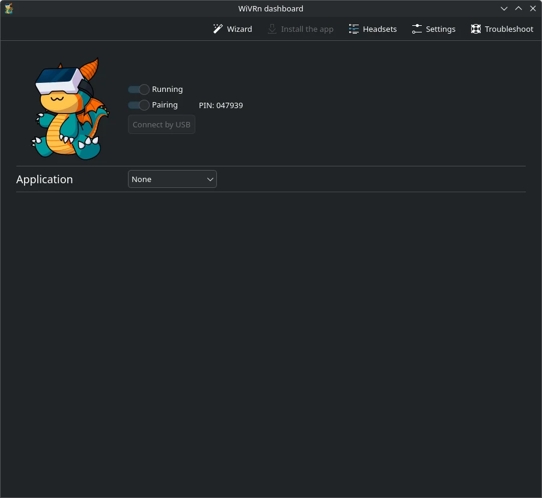
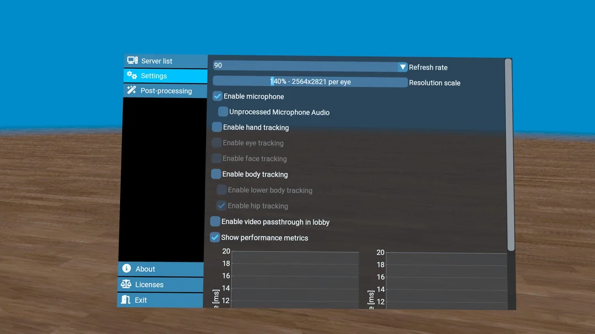
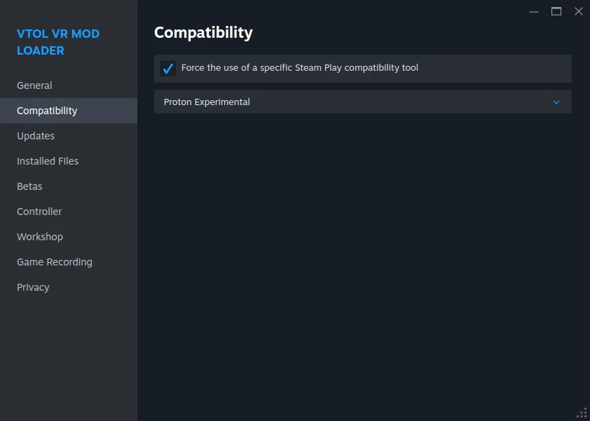

# WiVRn: A Comprehensive Wireless VR Guide

**_Please carefully read everything, especially the [requirements](#requirements) and [compromises](#compromises) sections, it will save you a lot of headaches._**

---
## Summary

The best way I have found to play with standalone VR headsets in Linux is by using [WiVRn](https://github.com/WiVRn/WiVRn). WiVRn is a solution similar to [ALVR](https://github.com/alvr-org/ALVR), [Air Link](https://www.meta.com/help/quest/509273027107091/), and [Virtual Desktop Standalone](https://www.meta.com/experiences/virtual-desktop/2017050365004772/), all providing a wireless solution to VR gaming. ALVR supports both Microsoft Windows and Linux, while both Air Link and Virtual Desktop Standalone both only support Microsoft Windows.

WiVRn supports both wired (via USB) and fully wireless play, but this guide only coveres wireless VR.

I fully consider standalone wireless VR as fully stable for regular everyday use, assuming all of the following requirements are met.

## Requirements

- **Basic knowledge of Linux and terminal/command line.**
	+ Not everything can be done with a GUI, and some terminal usage may be needed
	+ Basic knowledge of terminal and how to solve issues yourself will go a long way, especially if something goes wrong.
	+ Ability to search for help and answers on your own via Google/Reddit.

- **A  headset that is supported by WiVRn.**
	+ WiVRn supports the following headsets for wireless play:
		+ Quest 2, Quest 3, Quest 3S, Quest Pro, Pico Neo 4, HTC Vive Focus 3, and HTC Vive XR Elite

- **A decent WiFi 5 or newer (AC, AX) network.**
	+ WiVRn requires a decent wireless and wired network with little to no interference.
		+ _There is a wired USB mode for WiVRn, but I have not tested it myself, so it is not covered by this guide._

- **Wired Gigabit connection between computer and router.**
	+ Latency and quality will both have issues if you try using any form of wireless/hotspot to connect your computer to your router. Other solutions like Air Link, ALVR, and Virtual Desktop also **REQUIRE** a wired GIGABIT connection from the computer to the router, and so does this guide. ***YOU MUST HAVE WIRED ETHERNET FROM YOUR COMPUTER TO YOUR ROUTER!!!***
	
- **Linux kernel version 6.15 or newer.**
	+ [ntsync](https://docs.kernel.org/userspace-api/ntsync.html) requires newer kernels. Without it you may run into performance degradations, graphical glitches, or crashes, and some games will not work correctly at all (such as [VTOL VR](https://store.steampowered.com/app/667970/VTOL_VR/))

- **A proton branch that supports [ntsync](https://docs.kernel.org/userspace-api/ntsync.html), such as [Proton-GE](https://github.com/GloriousEggroll/proton-ge-custom) or [cachyos-proton-slr](https://share.cachyos.org/proton/).**
	+ In addition to kernel support, the used [proton](https://github.com/ValveSoftware/Proton) version must also fully support ntsync.

- A fully functioning [Steam](https://store.steampowered.com/about/) installation.

## Compromises

WiVRn has several limitations compared to other streaming solutions, especially those that utilize Microsoft Windows. Before deciding if this guide is for you, be aware of the following limitations:

- **No spacewarp/motion smoothing.**
	+ Currently no form exists for Linux that I personally know of. If you run older/weaker hardware and are already heavily dependent on frame gen to provide stable frame rates in VR, be aware that your FPS will be cut in HALF by moving to Linux due to lack of any motion smoothing. You can compensate by lowering your streaming resolution, but it will result in a loss of quality otherwise.

- **Time investment:**
	+ Expect some extra troubleshooting and setup, as per this guide. Knowledge is key, and although the switch from Windows to Linux seems daunting, it just takes learning and practice like with anything. This guide should help you on your journey, and make things far more painless for you.

- **Quality loss compared to Virtual Desktop:**
	+ Virtual Desktop Standalone for Quest 2/3/Pro headsets still has the edge on WiVRn when directly compared, and is a paid product. This is mainly because WiVRn does not yet support 10-bit encoding for H265 or AV1 yet, so you get more banding in your image. Hardware encoding in Linux on AMD GPUs has an encoding limit around 120 MBit/s. This doesn’t affect latency or overall usage -- WiVRn tends to look better than Meta Link or ALVR.
	
- **Loss of in-game voice commands:**
	+ [Voice commands](https://vtolvr.wiki.gg/wiki/Voice_Commands) require Windows Speech Recognition to be enabled to work, so this functionality doesn't work in Linux.
	
### Hardware Tested

Headset: Meta Quest 2 \
CPU: Ryzen 7 7800X3D \
GPU: Sapphire Nitro+ 7800 XT 16GB \
MEM: G.SKILL 2x16GB DDR5 6000 MT/s \
MOBO: GIGABYTE x670 Aorus Elite AX on F35 Bios \
PSU: Corsair RM750 \
Router: Asus AX-3000

### Software Tested

Distro: CachyOS \
Kernel: Linux 6.15.7-3-cachyos \
DE: KDE Plasma 6.4.3 \
Mesa: 25.1.6-cachyos1.3 \
Proton: proton-cachyos-10.0-20250714-ntsync-slr

### Games Tested

[VTOL VR](https://store.steampowered.com/app/667970/VTOL_VR/) \
[Tactical Assault VR](https://store.steampowered.com/app/2314160/Tactical_Assault_VR/)
	
---
# WiVRn Dashboard

There are two ways to install WiVRn, and which you choose will depend on your distro of choice. I highly recommend [Bazzite](https://bazzite.gg/) as it will greatly simplify not only setting up your entire system install, but greatly simplifies the setup. Arch based distros also provide the AUR package [wivrn-dashboard](https://aur.archlinux.org/packages/wivrn-dashboard) which has worked for me in both CachyOS and EndeavourOS, as well as vanilla Arch in the past.

Bazzite is an immutable distro with much of the system locked down to prevent user editing of the system files and/or configs. The main OS is based on images, and all applications run in Flatpaks or Appimages.

If using Bazzite, you can simply install the WiVRn server from "Bazaar", the Flatpak manager installed on your system by default. Open the program and use the search icon in the top left to search for "wivrn" and install the server Flatpak onto your system.

If you are on CachyOS, you can use the following command to use paru to install it from [Arch User Repository](https://aur.archlinux.org/packages/wivrn-dashboard):

>paru -S wivrn-dashboard

Regardless of your distro of choice, you should be able to easily find and launch WiVRn from your application launcher by searching for "wivrn".

## WiVRn Dashboard Setup

Go ahead and launch WiVRn if you have not already.

You will first be greeted by the setup wizard. For this guide, you can skip the wizard completely by clicking through it and accepting all defaults until you get to the main page:

Note the two sliders:
+ Running:
	+ If this is toggled off, WiVRn will not run or accept connections from any headsets. You should always leave this toggled on.
		+ _Note: The WiVRn dashboard **MUST** be open on your desktop or the server will not be running or accept new connections. Completely closing the WiVRn dashboard completely shuts it down entirely._

For Steam games, you need to copy the text included on this page using the “Copy” button and paste this into any VR games you want to play on Steam. Without these variables passed to the game in Steam, the game will not run in your headset correctly.

To set this up, you set launch options for the game in Steam. You have to do this for each VR game you want to play on your headset. I will cover this in more detail later in the guide.

Now let’s set up WiVRn optimally for streaming quality and performance. Go ahead and click the “Settings” button in the top right of the WiVRn dashboard.

Edit the following settings:

+ Manual foveation:
	+ Set this to a minimum of 20%. Setting it lower than 20% may result in encoder overload in Linux. You can increase the slider to higher values to decrease encoder load, but the higher you go the more the outside of the image in your headset will be rendered at a lower resolution, reducing image quality the higher you go.

+ Bitrate:
	+ This setting will depend on your encoder, available GPU power, and your wireless network. A good starting point is the default 50 MBit/s, which any decent router and network setup can easily handle. I personally use 120 MBit/s, as that is a decent balance of latency and quality.
		* _NOTE: Values higher than 120 MBit/s may result in encoder overload._
		* _NOTE: Close the app on your headset, fully shut down your VR game, and fully restart the dashboard to ensure the settings take full effect after making any changes._

+ Encoder Layout:
	+ To set up the encoder layout, use the drop down box and select the “Low latency preset”. This will split the encoder into three threads, and you can then click in each box and force each of them to vaapi with H.265. Make sure not to click the center of the boxes or it will create another encoder split and you will have to start over.

Refer to the following tables to determine what encoder and codec to use.

- Quest 2 | Quest Pro | Pico Neo 4 | HTC Vive Focus 3 | HTC Vive XR Elite:

| GPU    | Encoder | Codec |
| ------ | ------- | ----- |
| AMD    | vaapi   | H265  |
| NVIDIA | nvenc   | H265  |

- Quest 3, Quest 3S

| GPU    | Encoder | Codec |
| ------ | ------- | ----- |
| AMD    | vaapi   | AV1  |
| NVIDIA | nvenc   | AV1  |

You can try switching your codec to h.264 to get a reduction in latency, but note that you may see more banding in gradients if you do so. (This is true even on 8 bit displays!)

---
# WiVRn App

For Meta Quest headsets, simply install the WiVRn app from the Meta Quest store on your headset.

For others, you must download the APK and sideload it manually. The latest APK can be found on the [GitHub](https://github.com/WiVRn/WiVRn/releases) releases page for WiVRn.

## WiVRn App Setup

Once the app is installed, open it on your headset. You will be greeted by a simple UI. By default, passthrough will be enabled on headsets that support it.

Go ahead and click on your computer using the green “Connect” button. Make sure that the dashboard is open and running on your computer, and that your headset is connected to the same network.

You need to enter your pin PIN listed on the WiVRn dashboard the first time you connect to verify the connection.

Sometimes the code will time out as pairing mode disables after a few minutes for security. Move the pairing slider in WiVRn over to the right by clicking on it to re-enable pairing and try again.

Once connected to your computer, you should see a message stating it was successful like so:

At this point, WiVRn is connected to your computer and is waiting for a game to start. By default, there is no way to control your Linux desktop or launch games from within the headset itself, but we will address this shortcoming later in the guide.

Now click the blue “disconnect” button as we need to change some settings in the app directly for the best experience.

## WiVRn App Settings Tab

Select the settings page on the left side of the panel in front of you.

+ Refresh Rate:
	+ I recommend only using at max the 90 Hz refresh rate on battery powered headsets. 120 Hz will heat up your headset SOC and battery, and decrease your overall internal battery lifespan vs 90 Hz, as well as reduce battery life by around 25%.

+ Resolution scale:
	+ By default, WiVRn runs games at 140% resolution.
		+ The extra 40% accounts for [barrel distortion](https://developers.meta.com/horizon/documentation/native/pc/dg-render/). Note that this article applies to all modern headsets, not just Rift as the documents suggests.
		+ If you have a weaker GPU, you can turn this slider down to improve performance, which will result in a loss of image clarity. Note that turning the slider down will decrease the resolution and clarity in the center of the display first -- the lower the resolution slider is, the bigger the circle with a lower resolution will become.

+ Enable microphone:
	+ Enable this to allow the in-headset microphone to pass through to your computer. You will get a prompt from the headset asking to enable microphone permissions, and you must accept them for microphone passthrough to work.

+ Show performance metrics:
	+ Enable performance metrics which will show an overlay when you connect to games to troubleshoot performance (this overlay will show up by default and can be hidden by pushing both thumb sticks down at the same time). The overlay is a great troubleshooting tool.
	
## WiVRn App Post Processing Tab

Enable quality sharpening when running the default 140% resolution. If you turn the slider down, you would turn sharpening off and use quality supersampling instead.

Snapdragon Super Resolution has been replaced by the OpenXR processing options at the top, which you can see the warnings about by hovering over the yellow warning icon in the app.

---
# Valve Proton

The recommended proton version will vary depending on your distro.

## Bazzite
	
+ [Proton-GE](https://github.com/GloriousEggroll/proton-ge-custom)
	+ Install: Open up ProtonPlus from your application launcher (installed by default).

Click on “Proton-GE” listed at the top of the page in ProtonPlus.

Click on the download icon next to "Proton-GE Latest" and wait for it to download.

## CachyOS

+ [proton-cachyos](https://share.cachyos.org/proton/)
	* The latest version of proton-cachyos in the repos doesn't support ntsync yet, but a seperate version is downloadable from the cachyos website. Download the archive and extract it's contents to the following folder:
	
>~/.local/share/Steam/compatibilitytools.d/

Then fully restart steam, and then open up Steam settings and set “Proton-GE Latest” under the compatibility tab as your main proton version.

This will set Proton-GE as your desired version for all games, both VR and flatscreen, and is the recommended Proton version for Bazzite.

# Games that need tweaks

## VTOL VR

VTOL VR requires ntsync to run correctly, and enabling it is very simple. First, copy the command from WiVRn dashboard and paste it into VTOL VR’s properties page inside Steam.

Also set the “Selected Launch Option” to match my screenshot above, forcing OpenXR mode for the game on launch.

You need to add the following environmental variables to the launch options to enable ntsync:

`PROTON_USE_NTSYNC=1`

Put this at the end of the command, but before %command%

It should look like this:

`PRESSURE_VESSEL_FILESYSTEMS_RW=$XDG_RUNTIME_DIR/wivrn/comp_ipc:/var/lib/flatpak/app/io.github.wivrn.wivrn PROTON_USE_NTSYNC=1 %command%`

NOTE: VTOL VR by default in Linux will not update contacts on the NAV MFD correctly, and also has tons of multicrew sync issues, as well as many other strange bugs in multiplayer. You can resolve these issues by disabling Fsync and Esync in regular proton versions, but that also greatly degrades the performance of the game and drops your FPS by more than half. Enabling and using ntsync fixes all the issues without any FPS loss.

### VTOL VR Mod Loader:

Get the Mod Loader on Steam, it’s free here: [VTOL VR Mod Loader](https://store.steampowered.com/app/3018410/VTOL_VR_Mod_Loader/).

To use the mod loader in linux, you must force the mod loaders compatibility tool to “Proton-GE Latest” in steam under its properties or it won’t launch correctly. This must be forced as the mod loader defaults to a version of Proton that doesn't work.

To use the launcher with VTOL VR, you have to add the following to the launch options of the game (Not the mod loader!)

`PRESSURE_VESSEL_FILESYSTEMS_RW=$XDG_RUNTIME_DIR/wivrn/comp_ipc:/var/lib/flatpak/app/io.github.wivrn.wivrn PROTON_USE_NTSYNC=1 WINEDLLOVERRIDES="winhttp.dll=n,b" --doorstop-enabled true %command%`

Notes about additional launch options:

* `WINEDLLOVERRIDES="winhttp.dll=n,b" --doorstop-enable true`
   * This is required to get the game to actually launch with mods. Without it, clicking play in the mod loader will start the game with no mods enabled. To disable mods, change true to false.

You should be able to open the mod loader and enable the mods you want, then ensure "Settings" > "VR Mode" > "OpenXR" is enabled in the menu bar of the mod loader.

Clicking "Play" should start the game with mods enabled so long as true is set in the launch params, or you can launch VTOL VR normally.

---
# WiVRn Connection

Now, go ahead and reconnect WiVRn to your computer. It should say connected and is now waiting for you to start a game.

## Select Audio Devices

By default, WiVRn will configure the streaming audio devices on your computer, but both the output and input audio streams for WiVRn should be selected by you on your desktop.

You can do this by left clicking on the audio icon in your tray and selecting WiVRn as both default output and input devices while connected.

These should auto connect in the future when you connect, and only need to be selected the first time. The output will send your audio from your computer to your headset, and the input will send the Quest headset's microphone back to your computer for the game to use.

If you use a different audio device like a separate headset, just select those audio devices instead.

## Testing a game

At this point, it is a good idea to just launch a VR gae and see how the it runs before playing with mods. You will have to manually run the game from Steam on you monitor the first time.

If the game starts on your desktop but doesn’t connect to the headset, try fully re-booting WiVRn and Steam. Sometimes it also takes a full reboot of the headset and computer to make things work.

You way tweak the WiVRn dashboard settings as discussed previously. Try increasing or lowering the bitrate as needed.

---
# wlx-overlay-s:

[wlx-overlay-s](https://github.com/galister/wlx-overlay-s) is a VR overlay for Linux that allows you to fully control your desktop from within VR, similar to how overlays such as xsoverlay or ovr toolkit work in SteamVR on Windows.

You will be able to fully control your PC monitors, type on a virtual keyboard, listen to music, watch videos, and use your web browser in your headset.

## wlx-overlay-s Install

Installing wlx-overlay-s will vary depending on your distro of choice.

### Bazzite:

Go to the [GitHub](https://github.com/galister/wlx-overlay-s/releases) page and download the latest AppImage from the releases page.

Then open Bazaar and search for "Gear Lever" and install it. We will use it to install and manage AppImages on your system

Once downloaded, right click on the Appimage file on your computer and select “Open with Gear Lever”.

You must click “unlock” to verify you want to make changes in Gear Lever, then you can click “Move to the app menu” to install the Appimage on your system. The image will be moved into the folder “AppImages” in your home folder and will have its permissions updated automatically.

To allow Gear Lever to automatically update the Appimage, set the source to GitHub and paste the following to always get the latest version directly from the GitHub page:

>https://github.com/galister/wlx-overlay-s/releases/download/*/*-x86_64.AppImage

Then click “Save”. You can check for updates by refreshing metadata at the top of the page.

In the top right of Gear Lever, you can go into settings to set up update notifications for any installed AppImages automatically.

### CachyOS

Simply install the following AUR package:

> paru -S wlx-overlay-s-git

## wlx-overlay-s Setup

You can automatically set wlx-overlay-s to run automatically once your headset connects to WiVRn.

Go to the main WiVRn dashboard page again.

Notice the "Application" field on this page -- this is the default program that WiVRn will run once you connect to your computer.

Set application to custom and enter the following depending on your distro of choice:

+ For Bazzite (_NOTE: Change **USERNAME** to match your user account name!_):
>/var/home/USERNAME/AppImages/wlxoverlays.appimage

+ For CachyOS:
>wlx-overlay-s

Note that the first time you connect, a window will pop up on your desktop.

wlx-overlay-s needs to know which monitors you have connected to your computer in a specific order.

Follow the pop up messages in the lower right of your monitor and select your displays in the order it tells you to do so. You only have to do this once.

Once the window selections have completed on the PC, you should be able control your desktops now. wlx-overlay-s has a unique control scheme, and you can find out more about it starting on the[ GitHub page.](https://github.com/galister/wlx-overlay-s?tab=readme-ov-file#the-watch)

I recommend fully reading the GitHub page when you have the time. You can customize your controller bindings, disable the quest pass-through, disable space move, and even set a custom texture background for your environment. All the info is already located at the wlx-overlay-s[ GitHub page.](https://github.com/galister/wlx-overlay-s) I won't cover these in the guide as the information is already listed there, and much of the setup is specific to each user's preferences.

# Troubleshooting

+ If in doubt, clearly check the REQUIREMENTS/PREREQUISITES and COMPROMISES sections of this guide to make sure you haven't missed or misunderstood anything. Sometimes taking a break is a good idea and coming back later with a clear frame of mind, especially if you are feeling overwhelmed and/or frustrated.
+ Lag and/or fast connecting/disconnects:
	+ Try restarting your Quest headset. It sometimes happens and is an issue on the headset side. A reboot of your headset will usually fix these issues. If the issue persists, try completely rebooting your computer. If these issues persist, suspect your network has hardware or interference issues.
+ Quality and/or bitrate low:
	+ Most common issue is poor network performance. A good router is required, but so is a good connection between the router and your headset, as is between your computer and the router. Sometimes the air will be over-saturated with too much data traffic, or maybe even your LAN is being overwhelmed or having issues due to faulty hardware/software. Advanced setup of both wired and wireless networks is not covered by this guide, as that is a very complicated topic by itself. Another issue is poor GPU performance. Give the COMPROMISES section another quick read, and also take into consideration your hardware specs.
